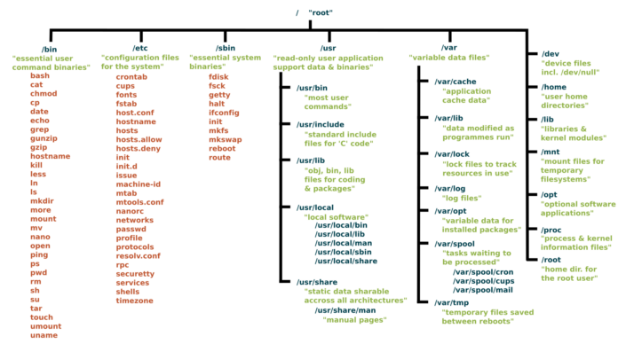

# Starting Guide
### This guides purpose is to give you a good understanding of the basics of linux.

## 1: The Linux Filesystem.
### */boot*: 
This is a different partition
 mounted onto a root directory, this contains all the executables responsable for making sure your system boots correctly, the most popular bootloader is GRUB. which uses a configuration file to boot into a kernel.

### */bin*:
This is the root directory that holds "binaries" also known as executables. */bin* is usually a symlink to */usr/bin* . The differences of these is */bin* contains usually root/important binaries the system requires.

### */dev*
*/dev* contains temporary device fles, that usually are made instantly and deleted apon shutdown such as a mouse, keyboard, usb drive etc

### */etc*
*/etc* is esentially the "i didnt know where else to put it" directory, it is basically the dumping ground for configuration files mostly but other things as well

### */home*
*/home* is what your users envirement is always in. it is where user-specific configuration files are as well as your download, pictures, documents etc

### */lib*
*/lib* is where libraries are. They have small anounts of code that certain applications use. there are other */lib* directories in your system but */lib* is the most important, it contains important pieces of code for wifi, kernel etc

### */mnt*
*/mnt* is the "mount" directory. this isnt something you usually use on a day to day basis but it is very important for mounting filesystems and chrooting into them. but chrooting is something we will learn later.

### */media*
*/media* is where most external media devices will be mounted at. theres not too much important about this directory

### */opt*
*/opt* is where your own programs will be, such as if you program an app that you want to be avalible system wide. 

### */proc/*
*/proc* is alot like */dev* it is a virtual filesystem/directory, it contains information about your hardware mostly such as cpu, gpu, kernel etc
a fun little thing you can do to look at cpu specs is in the terminal type `cat /proc/cpuinfo` and press enter, you will see a list of information of your cpu such as cores, model, ghz etc

### */root* 
*/root* is the root users home directory, the root user is the largest system admin with no limits of what they can do.

### */run*
*/run* is a directory where apps will store temporary data for themselves, unless you knows exactly what your doing dont mess with this folder.

### */sbin*
*/sbin* contains binaries that we spoke of earlier that ONLY the root/superuser may run but arent needed consistantly such as "cfdisk" "chroot" etc

### */usr/*
*/usr* is a very important directory. it usually is a good middle-man between root and user as it will contains things the user may run without superuser permissions. it contains directories like */usr/bin* which originally contained user binaries such as firefox, mutt, filemanager etc. but but now-a-days almost every mainstream linux distro puts everything into */usr/bin*  and points */bin* too */usr/bin* for safety reasons

### */srv* 
*/srv* is something you usually wont touch unless your into web development. */srv* is where web-pages and its database and other dependacies reside.

### */sys*
*/sys* is again another virtual directory like */dev* and */proc* except */sys* contains important information for your hardware. usually for things such as wifi-card, keyboard backlight. battery and other things. unless you know what your doing you shouldnt really mess with this directory

### */tmp*
*/tmp* contains temporary files for the system, such as your browser but will be gone by the time you shut off your computer, unlike most other root directories you may read/write /tmp without using superuser permissions

### */var*
*/var* now a days usually contains log files for the system

here is a little picture for help to understand this

